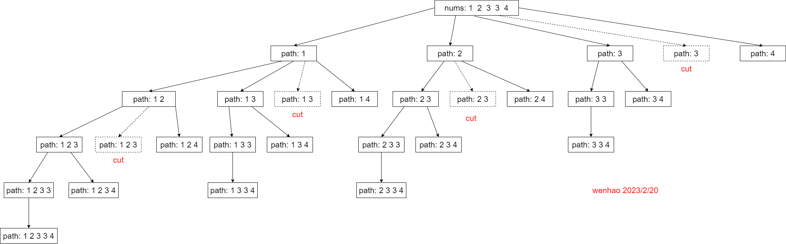

# 多读我😊

> **回溯&搜索** 套路总结

**回溯&搜索** 问题大致有 **2** 种解法：`for` 循环写法和 `选或者不选写法`，
这两种写法都是使用递归思想：**假设选取这个数，然后递归的处理剩下的数，并在这个过程中记录答案**

## `for` 循环写法

> `for` 循环写法的适用范围更广，
> 比如：有重复元素的情况（这种情况 “选或者不选写法” 貌似不好解决）

**思路分析：**

重复元素子集树：



子集问题不考虑路径顺序，对于有重元素可以先排序后回溯。
从子集树中可以看出：dfs 只需要关注 i 之后的元素就行，之前的元素会被上一轮的递归处理。

在本次递归中：我们可以选择 `i to len(nums) - 1` 中的任意一个，然后继续向下递归。

对于重复元素，需要对子集树进行剪枝（图中 **cut**），从图中也能发现，
每次✂的元素是第二个（及后面的）重复元素，这是 **因为** 选取第一个重复元素得到的 path，
大于等于选取后面重复元素的 path。所以每次 dfs 只需选第一个重复元素，而忽略其余重复元素。

注意：在递归前后要进行 path 的恢复

**代码示例：组合2 有重复不可复选**

```python
def combinationSum2(self, candidates, target: int):
    n = len(candidates)
    ans = []
    path = []
    candidates.sort()

    # for 的写法
    def dfs(i: int, t :int):
        # 判断是否找到答案
        if t == 0:
            ans.append(path.copy())
            return
        # 剪枝
        if t < 0 or i >= n:
            return
        # 从 i 开始选，而不是选 i
        for j in range(i, n):
            if j > i and candidates[j] == candidates[j - 1]:
                continue
            path.append(candidates[j])  # 有 add
            dfs(j + 1, t - candidates[j])
            path.pop()  # 就得有 pop

    dfs(0, target)  # 从 0 开始选
    return ans
```


## 选或者不选写法

这种写法很直观，每次 dfs 只有两种选择：选或者不选。

模拟这两种选择，继续 dfs 就行。但是，这种写法处理不了有重复元素的情况，如上例

**代码示例：组合**

```python
# 选或者不选的写法
def combine1(self, n: int, k: int):
    ans = []
    path = []

    def dfs(i: int, d: int):
        if len(path) == k:
            ans.append(path.copy())
            return
        if i < d:
            return
        # 不选
        dfs(i - 1, d)
        # 选
        path.append(i)
        dfs(i - 1, d - 1)
        path.pop()

    dfs(n, k)
    return ans
```

## 全排列问题

> **全排列** 和 **有重复元素的全排列** 稍微有些复杂

**代码示例：[剑指 Offer 38](https://leetcode.cn/problems/zi-fu-chuan-de-pai-lie-lcof)**

```python
def permutation(self, s: str):
    s = sorted(s)
    n = len(s)

    ans = []
    path = []
    vis = [False] * n  # 排列需要使用

    def dfs():
        if len(path) == n:
            ans.append("".join(path))

        for j in range(0, n):  # 每次从 0 开始选没用过的
            if vis[j]:
                continue
            # 注意这个逻辑：去重复元素的影响
            if j > 0 and s[j] == s[j - 1] and not vis[j - 1]:
                continue
            vis[j] = True
            path.append(s[j])
            dfs()
            path.pop()  # 恢复现场
            vis[j] = False
    dfs()
    return ans
```


